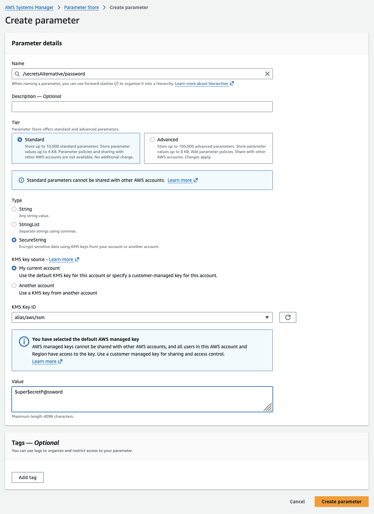
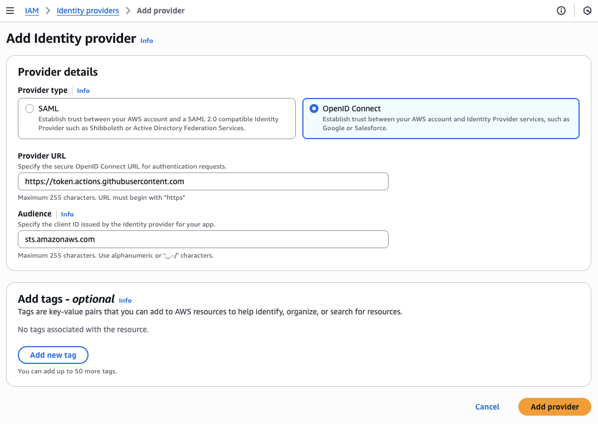
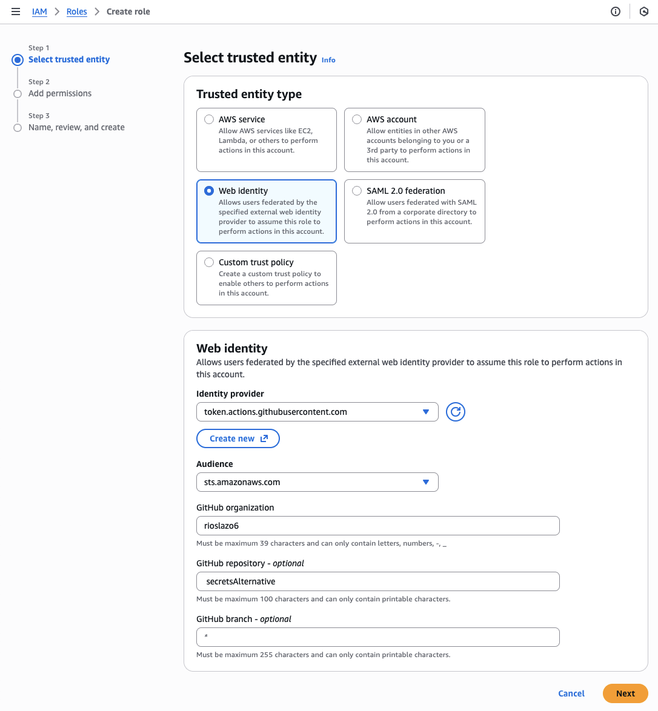
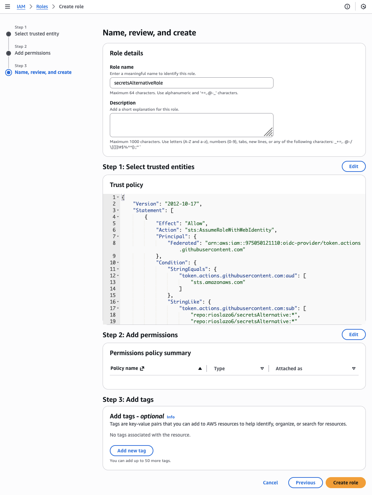
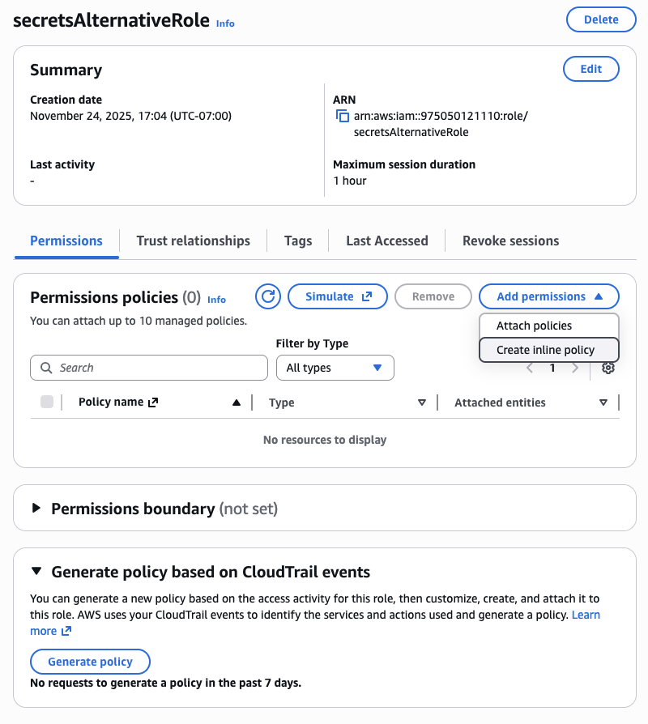
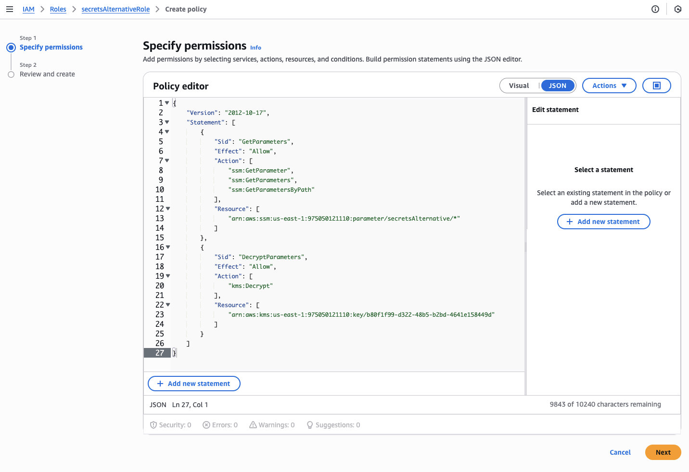
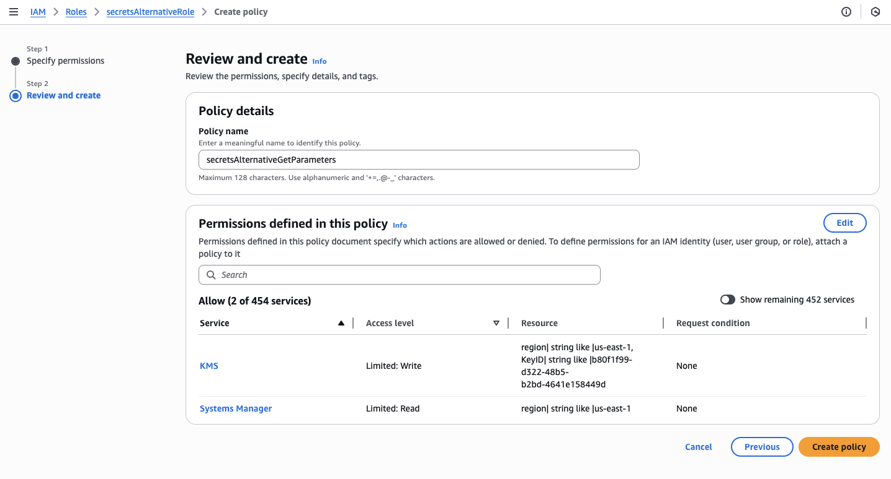
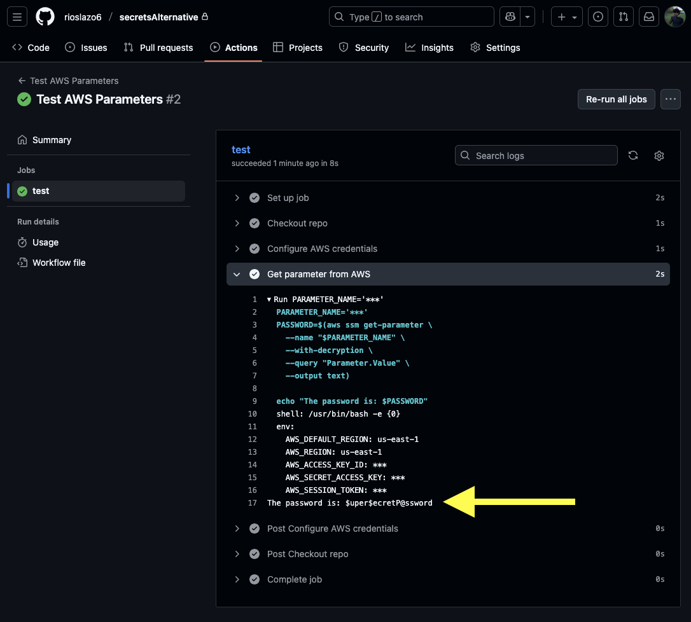

# Storing secrets in the AWS Systems Manager Parameter Store

## Introduction

During this course, we have stored multiple pieces of sensitive information (like passwords and tokens) as GitHub secrets, which is secure, convenient, and straightforward, but I got curious about whether there were any alternatives. I decided to look into this and demonstrate at least one other way to store secrets safely: the Parameter Store in the AWS Systems Manager.

## Motivation

GitHub secrets are stored encrypted, and it is very easy to use them in workflows, but there were a couple of minor inconveniences that prompted my question.

The first one is that once a secret is saved in GitHub, it is no longer possible to see its value directly. Unless a secret is also stored somewhere else, retrieving it is not an option (there is a workaround that requires creating a workflow that retrieves the secret and prints it, but there are security concerns associated with logging sensitive data, so this should be avoided).

The second concern is that a secret saved at the repository level cannot be used in other repositories, so if there are multiple repositories that need to use the same secrets, like DB passwords or API keys, these must either be stored separately for each repository (and duplication is bad; if these secrets change in the future, we would need to update them in every single repo that uses them), or they would need to be stored as [organization level secrets](https://docs.github.com/en/actions/how-tos/write-workflows/choose-what-workflows-do/use-secrets#creating-secrets-for-an-organization), which can only be accessed for free by public repositories.

## Alternatives

When researching options, the first one I found was the [AWS Secrets Manager](https://aws.amazon.com/secrets-manager/), which is powerful and has tons of features, but there is a cost associated with it: currently $0.40 per secret and $0.05 per 10,000 API calls. Thankfully, AWS also offers the [Systems Manager Parameter Store](https://docs.aws.amazon.com/systems-manager/latest/userguide/systems-manager-parameter-store.html), which is free in the standard tier (up to 10,000 parameters of up to 4 KB each). There are also other solutions with different sets of features and pricing models like Microsoft's [Azure Key Vault](https://azure.microsoft.com/en-us/products/key-vault), Google's [Secret Manager](https://cloud.google.com/security/products/secret-manager), and even the open source [HashiCorp Vault](https://www.hashicorp.com/en/products/vault), but since we are already using AWS for this course, I decided to go with the AWS Systems Manager Parameter Store.

## Implementation

### Create parameter

This is the secret that you want to store and access.

- In the AWS Management Console, navigate to the Systems Manager service > Parameter Store > Create parameter.
- Give your parameter a name, choose the **SecureString** option if it is a sensitive value like a password, enter its value, and click on **Create parameter** to save it.



### Add identity provider

An identity provider allows GitHub Actions to assume an AWS role without needing to store AWS keys.

_Note: we already created an identity provider early in the course, so if one already exists with these values, these steps can be omitted._

- In AWS, navigate to IAM > Identity Providers > Add provider.
- Choose **OpenID Connect** as the type.
- Enter `https://token.actions.githubusercontent.com` as the Provider URL and `sts.amazonaws.com` as the audience, then click **Add provider** to save it.



### Create role

We need a role that GitHub Actions will assume, which will give it permissions to access the Parameter Store.

- Go to AWS IAM > Roles > Create role.
- Select **Web Identity** as the type.
- Select the same Identity provider and Audience that were entered earlier.
- Enter your GitHub user as the organization, and optionally, the repository and branch you want to access the secrets from.



- Skip the permission policies for now. The proper permissions will be added after creating the role.
- Give your role a name, and click **Create role** to save it.



- Once the role is created, click on it.
- Under the Permissions tab, click on **Add permissions**, and then **Create inline policy**.



- Select the JSON mode, and paste the following:

```
{
	"Version": "2012-10-17",
	"Statement": [
		{
			"Sid": "GetParameters",
			"Effect": "Allow",
			"Action": [
				"ssm:GetParameter",
				"ssm:GetParameters",
				"ssm:GetParametersByPath"
			],
			"Resource": [
				"arn:aws:ssm:{Region}:{Account}:parameter/{ParameterNameWithoutLeadingSlash}"
			]
		},
		{
			"Sid": "DecryptParameters",
			"Effect": "Allow",
			"Action": [
				"kms:Decrypt"
			],
			"Resource": [
				"arn:aws:kms:{Region}:{Account}:key/{KeyId}"
			]
		}
	]
}
```

- This policy allows this role to access the Systems Manager parameters, and to decrypt them. Make sure to modify the `Resource` value under each statement in the JSON above; the first one points to the parameter(s) that you want the role to be able to access, and the second one to the key needed to decrypt any encrypted values (this must match the KMS key selected when creating the parameter; if the default one was selected, you can find it under Key Management System > AWS managed keys > aws/ssm).
- Click **Next**.



- Give the policy a name.
- Click on **Create policy** to save it.



### Create or modify workflow

Now that we have a role with the proper permissions that GitHub Actions can assume, we need to make sure our workflow is setup to assume that role and to read from the AWS Parameter Store.

- This is an example .yml file for a workflow that runs manually; this simply assumes the role, accesses the parameter, and prints it.

```
name: Test AWS Parameters

on:
  workflow_dispatch:

jobs:
  test:
    runs-on: ubuntu-latest

    permissions:
      id-token: write
      contents: read

    steps:
      - name: Checkout repo
        uses: actions/checkout@v4

      - name: Configure AWS credentials
        uses: aws-actions/configure-aws-credentials@v4
        with:
          aws-region: us-east-1
          role-to-assume: arn:aws:iam::${{ secrets.AWS_ACCOUNT_ID }}:role/${{ secrets.AWS_IAM_ROLE }}

      - name: Get parameter from AWS
        id: get-ssm-param
        run: |
          PARAMETER_NAME='${{ secrets.AWS_PARAMETER_NAME }}'
          PASSWORD=$(aws ssm get-parameter \
            --name "$PARAMETER_NAME" \
            --with-decryption \
            --query "Parameter.Value" \
            --output text)

          echo "The password is: $PASSWORD"
```

_Note: in this example, the AWS account ID, role name, and parameter name are stored in GitHub secrets though they are not necessarily sensitive in nature._

- Running the workflow shows that the parameter was retrieved successfully!



_Note: this parameter is being printed for demonstration purposes only. In a real workflow, you would use it directly, or pass it to the next step without logging it._

## Conclusion

GitHub secrets is an easy way to store sensitive pieces of data to use in GitHub Actions; however, if a particular use case requires more features than what GitHub secrets offer, there are alternatives available. The Parameter Store in the AWS Systems Manager is a great option for its low cost, strong security, and added functionality, like granular access control, hierarchical storage, version tracking, etc. Though it requires some initial setup, it is not overly complicated, and after the initial configuration it is easy to add more parameters, see previous ones if needed, access the same parameters from multiple repos, and more.
